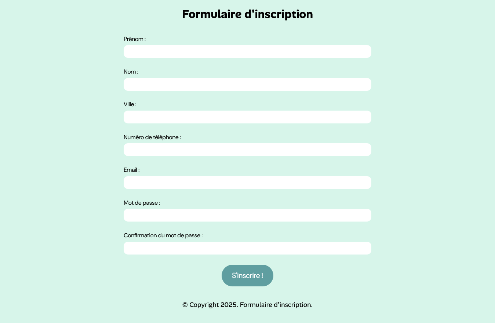

## FORMULAIRE D'INSCRIPTION

## Le challenge

Ce projet contient les différents champs nécéssaires à l'inscription sur un site internet comme le champ prénom, le champ nom, le champ ville, le champ numéro de téléphone, le champ email, le champ mot de passe et le champ confirmation du mot de passe.

J'ai utilisé les regex ou expressions régulières afin de m'aasurer que les différents valeurs saisies par l'internaute correspondent bien à ce qui est attendu. Par exemple, ma regex nommé regexName permet de m'assurer que le nom et le prénom commencent bien par une majuscule et ne contiennent pas de chiffre.

## Démonstration

Lien vers le projet : https://aperbet56.github.io/registration__form/

## Projet développé avec

- Utilisation des balises sémantiques HTML5
- CSS3
- Flexbox
- Utilisation d'un normaliseur : le fichier normalize.css
- Importation des polices "Alan Sans" et "DM Sans"
- Page web responsive
- Desktop first
- JavaScript
- Code JavaScript commenté
- Regex
